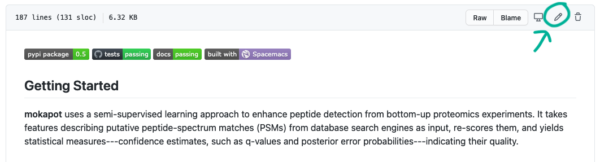

Contributing to **mokapot**
===========================

First off, thanks you for taking the time to contribute.

The following document provides guidelines for contributing to the documentation
and the code of mokapot. **No contribution is too small!** Even fixing a simple
typo in the documentation is immensely helpful.

Contributing to the documentation
---------------------------------

We use `sphinx <https://www.sphinx-doc.org/en/master/>`_ generate our
documentation and deploy it to this site. Most of the pages on the site are
created from simple text files written in the reStructuredText markup language.
There are two exceptions to this:

1. The API and command line documentation are automatically generated from the
   documentation contained in the code.

2. The Vignettes are created from Jupyter notebooks.

Editing most documents
++++++++++++++++++++++

The easiest way to edit a document is by clicking the "Edit on GitHub" like in
the top right hand corner of each page. You'll then be taken to GitHub where to
you can click the pencil to edit the document:

You can then make your changes directly on GitHub. Once you're finished fill in
a description of what you changed and click the "Propose Changes" button.

Alternatively, these documents live in the :code:`docs/source` directory of the
repository and can be edited like code. See `Contributing to the code`_ below for
more details on contributing this way.

Editing the Vignettes
+++++++++++++++++++++

Depending on what needs to change, there are two paths to updating the
vignettes:

1. **If only the text needs to be changed:** Click the "View page source" button
   at the top left corner of the vignette you want to edit. Then follow the
   steps under `Editing most documents`_ above. Note that, because these are
   Jupyter notebooks and not flat text files, they will be more difficult to
   look through.

2. **If the code needs to be changed:** This modification needs to be done
   similarly as editing the mokapot source code (see `Contributing to the code`_).
   Briefly, you'll need to clone the repository from GitHub then navigate to
   :code:`docs/source/vignettes`. You then need to start-up the Jupyter notebook
   for the vignette you wish to edit and make your change. After making your
   change, make sure to restart the notebook and run all cells. After this has
   been completed, save the notebook and commit the edited version to the
   repository. Be sure to explicitly detail the change you made when submitting
   your pull request.

Contributing to the code
------------------------

We welcome contributions to the source code of mokapot---particularly ones that
address discussed `issues <https://github.com/wfondrie/mokapot/issues>`_.

Contributions to mokapot follow a standard GitHub contribution workflow:

1. Create your own fork of the mokapot repository on GitHub.

2. Clone your forked mokapot repository to work on locally.

3. Create a new branch with a descriptive name for your changes:

   .. code-block:: bash

      git checkout -b fix_x

4. Make your changes (make sure to read below first!).

5. Add, commit, and push your changes to your forked repository.

6. On the GitHub page for you forked repository, click "Pull request" to propose
   adding your changes to mokapot.

7. We'll review, discuss, and help you make any revisions that are required. If
   all goes well, your changes will be added to mokapot in the next release!

Python code style
+++++++++++++++++

The mokapot project follows the `PEP 8 guidelines
<https://www.python.org/dev/peps/pep-0008/>`_ for Python code style. More
specifically, we use `black <https://black.readthedocs.io/en/stable/>`_ to
format code and lint Python code in mokapot.

We highly recommend setting up a pre-commit hook for black. This will run black
on all of the Python source files before the changes can be committed. Because
we run black for code linting as part of our tests, setting up this hook can
save you from having to revise code formatting. Take the following steps to set up
the pre-commit hook:

1. Verify that black and pre-commit are installed. If not, you can install them
   with pip or conda:

   .. code-block:: bash

      # Using pip
      pip install black pre-commit

      # Using conda
      conda -c conda-forge black pre-commit

2. Navigate to your local copy of the mokapot repository and activate the hook:

   .. code-block:: bash

      pre-commit install

One the hook is installed, black will be run before any commit is made. If a
file is changed by black, then you need to :code:`git add` the file again before
finished the commit.
